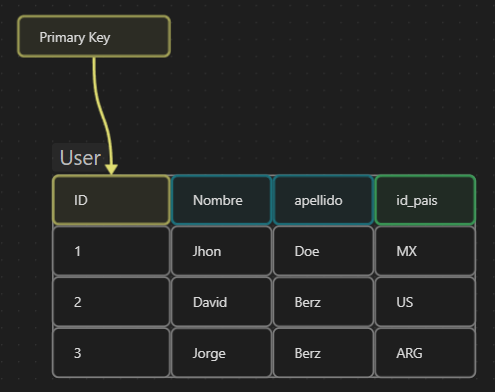

Una clave primaria (primary key, en inglés) es un campo o conjunto de campos en una tabla de base de datos que identifica de forma única cada fila o registro en la tabla. En otras palabras, una clave primaria se utiliza para garantizar que no haya filas duplicadas en una tabla y para identificar de manera única cada fila en la tabla.

# Reglas

Existen algunas reglas y requisitos importantes que deben cumplirse al definir una clave primaria en una tabla de base de datos:

1.  La clave primaria debe ser única:
	- cada valor de clave primaria debe ser único para cada fila en la tabla. Esto garantiza que no haya duplicados en la tabla y que cada fila se pueda identificar de forma única.
    
2.  La clave primaria no puede ser nula:
	- cada fila en la tabla debe tener un valor para la clave primaria. Si se permite que la clave primaria sea nula, puede resultar en filas duplicadas o ambigüedad en la identificación de las filas.
    
3.  La clave primaria debe ser estable:
	- una vez definida, la clave primaria no debe cambiar. Esto garantiza que las referencias a la clave primaria en otras tablas o aplicaciones sigan siendo válidas a lo largo del tiempo.
    
4.  La clave primaria debe ser de tamaño razonable:
	- la columna o conjunto de columnas que conforman la clave primaria no deben ser excesivamente grandes. Esto puede hacer que la tabla sea lenta para buscar y ordenar, así como ocupar demasiado espacio en la base de datos.
    
5.  La clave primaria debe ser fácil de generar:
	- si se utiliza una clave primaria numérica autonumérica (como un ID de cliente), la clave primaria debe ser fácil de generar automáticamente para cada nueva fila en la tabla.
    

Estas reglas y requisitos son importantes para garantizar la integridad y la eficiencia de la tabla de la base de datos. Es importante elegir cuidadosamente qué columna o conjunto de columnas se utilizará como clave primaria y garantizar que cumpla con estas reglas y requisitos antes de crear la tabla.