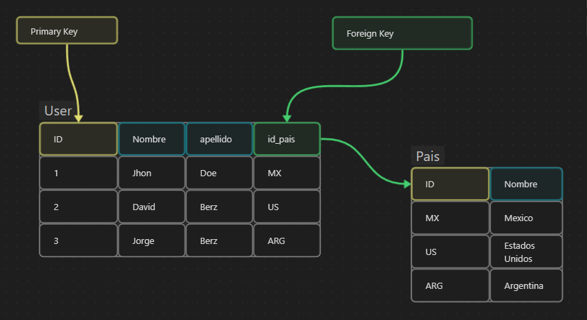

Una clave foránea (foreign key en inglés) es un campo o conjunto de campos en una tabla de base de datos que se relaciona con la clave primaria de otra tabla. En otras palabras, una clave foránea se utiliza para establecer una relación entre dos tablas de la base de datos.

La clave foránea en una tabla apunta a la clave primaria de otra tabla, lo que significa que cada valor de la clave foránea debe coincidir con un valor de la clave primaria en la otra tabla. Esta relación entre tablas se utiliza para garantizar la integridad de los datos y para permitir consultas y actualizaciones de datos relacionados.

Por ejemplo, si se tiene una tabla de pedidos y una tabla de clientes, se puede establecer una relación entre las dos tablas utilizando una clave foránea. En la tabla de pedidos, se puede agregar una columna de `id_cliente` que corresponda a la clave primaria `id_cliente` en la tabla de clientes. De esta manera, se puede realizar una consulta para obtener todos los pedidos de un cliente específico utilizando su `id_cliente`.

Es importante tener en cuenta que las claves foráneas solo pueden apuntar a claves primarias existentes en otras tablas. Si se intenta agregar una fila a la tabla que contiene una clave foránea que no coincide con ningún valor en la clave primaria correspondiente en la otra tabla, la base de datos generará un error y no se agregará la fila.

Las claves foráneas son una herramienta útil para crear relaciones entre tablas en una base de datos y garantizar la integridad de los datos relacionados. Sin embargo, también es importante tener en cuenta el rendimiento y la escalabilidad de las consultas con múltiples tablas cuando se diseñan y utilizan claves foráneas en una base de datos.

# Reglas

Las claves foráneas son una herramienta útil para establecer relaciones entre tablas en una base de datos. Para garantizar que estas relaciones sean correctas y eficaces, existen algunas reglas y requisitos importantes que deben cumplirse al definir una clave foránea:

1.  La clave foránea debe apuntar a una clave primaria existente:
	- la clave foránea debe apuntar a una clave primaria en otra tabla existente. Si la clave primaria no existe, la clave foránea no será válida.
    
2.  Los tipos de datos de la clave foránea y la clave primaria deben ser compatibles:
	- los tipos de datos de la clave foránea y la clave primaria deben ser compatibles. Por ejemplo, si la clave primaria es de tipo `int`, la clave foránea debe ser de tipo `int` para que puedan compararse correctamente.
    
3.  Los valores de la clave foránea deben coincidir con los valores de la clave primaria:
	- cada valor de la clave foránea debe coincidir con un valor de la clave primaria en la tabla a la que apunta. Esto garantiza que cada fila en la tabla con la clave foránea tenga una relación correcta con la otra tabla.
    
4.  Los valores de la clave foránea deben ser únicos o nulos:
	- los valores de la clave foránea pueden ser nulos si la relación es opcional, pero si se requiere una relación, cada valor de la clave foránea debe ser único.
    
5.  Las claves foráneas deben estar indexadas:
	- las claves foráneas deben estar indexadas para garantizar un rendimiento óptimo en las consultas que involucren múltiples tablas.
    
6.  Los valores de la clave primaria a los que apunta la clave foránea no deben modificarse ni eliminarse:
	- si se modifican o eliminan los valores de la clave primaria a los que apunta la clave foránea, la integridad de los datos se verá comprometida. Por lo tanto, se deben tomar medidas para garantizar que los valores de la clave primaria no se puedan modificar o eliminar si se usan como clave foránea en otras tablas.
    

Estos son algunos de los requisitos y reglas importantes que deben cumplirse al definir una clave foránea en una tabla de base de datos. Al asegurarse de que se cumplan estas reglas, se pueden crear relaciones correctas y eficaces entre las tablas en una base de datos.

