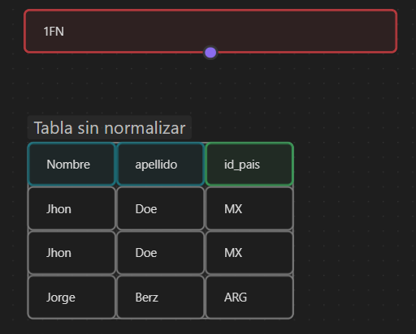
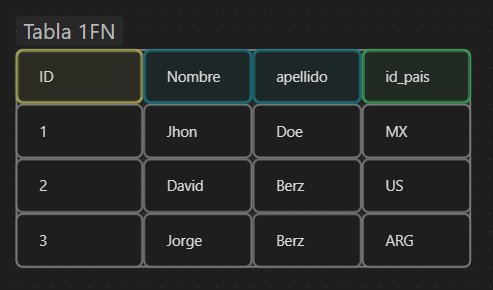

La normalización de la base de datos es un proceso de diseño de bases de datos que se utiliza para reducir la redundancia de datos y mejorar la integridad de los datos. La normalización se logra mediante la organización de datos en tablas y la aplicación de reglas que eliminan la redundancia y garantizan que los datos estén en una forma normalizada y consistente.

El proceso de normalización de la base de datos se divide en varias formas normales (1NF, 2NF, 3NF, etc.), cada una con sus propias reglas y requisitos. A continuación se presentan algunas de las formas normales más comunes y sus características:

## 1FN

1.  Primera Forma Normal (1NF):
	- La primera forma normal establece que cada columna en una tabla debe tener un único valor atómico, lo que significa que no debe haber valores repetidos o múltiples en una columna. Además, cada fila debe ser única y debe tener un identificador único para identificarla.
	- 
	-  

## 2FN

2.  Segunda Forma Normal (2NF):
	- La segunda forma normal se aplica después de haber cumplido con la primera forma normal. Establece que cada columna en una tabla debe depender completamente de la clave primaria. Esto significa que si una tabla tiene una clave primaria compuesta por varias columnas, cada columna en la tabla debe depender de todas las columnas de la clave primaria.

	- 

## 3FN

3.  Tercera Forma Normal (3NF):
	- La tercera forma normal se aplica después de haber cumplido con la segunda forma normal. Establece que no debe haber dependencias transitivas entre las columnas en una tabla. Esto significa que si una columna depende de otra columna que a su vez depende de otra columna, se debe crear una nueva tabla para separar las dependencias.


### Dependencia Transitiva

```ad-note
title: Dependencia Transitiva
```

En SQL, una dependencia transitiva ocurre cuando una columna no clave depende de otra columna que no es clave, sino que depende de otra columna que sí es clave.

Un ejemplo de dependencia transitiva en SQL sería el siguiente:

Tenemos una tabla "Clientes" con las siguientes columnas:

-   ID_Cliente (Clave primaria)
-   Nombre_Cliente
-   Ciudad
-   Pais

La columna "ID_Cliente" es la clave primaria de la tabla y no hay dependencias transitivas en las columnas "Nombre_Cliente" y "ID_Cliente". Sin embargo, la columna "Ciudad" depende de la columna "Pais" y, por lo tanto, hay una dependencia transitiva en la tabla.

Para resolver esta dependencia transitiva, debemos separar la tabla "Clientes" en dos tablas: "Clientes" y "Ciudades". La tabla "Clientes" tendrá las siguientes columnas:

-   ID_Cliente (Clave primaria)
-   Nombre_Cliente
-   ID_Ciudad (Clave foránea a la tabla "Ciudades")

La tabla "Ciudades" tendrá las siguientes columnas:

-   ID_Ciudad (Clave primaria)
-   Ciudad
-   ID_Pais (Clave foránea a la tabla "Paises")

Al dividir la tabla "Clientes" en dos tablas separadas, eliminamos la dependencia transitiva en la columna "Ciudad" y garantizamos que la base de datos cumpla con la Tercera Forma Normal (3FN).

En resumen, en SQL una dependencia transitiva ocurre cuando una columna no clave depende de otra columna que no es clave, sino que depende de otra columna que sí es clave. Para evitar estas dependencias transitivas, debemos normalizar la base de datos y separar las tablas en estructuras más pequeñas y coherentes.

### Dependencia Funcional

```ad-note
title: Dependencia Funcional
```

En SQL, una dependencia funcional se refiere a la relación entre dos o más columnas de una tabla. Si una columna determina el valor de otra columna en la misma tabla, se dice que hay una dependencia funcional entre ellas.

Por ejemplo, en una tabla "Clientes" con las siguientes columnas:

-   ID_Cliente (Clave primaria)
-   Nombre_Cliente
-   Ciudad
-   Pais

Podemos decir que hay una dependencia funcional entre la columna "ID_Cliente" y las columnas "Nombre_Cliente", "Ciudad" y "Pais", ya que el valor de cada una de estas columnas depende del valor de la columna "ID_Cliente".

En SQL, podemos expresar esta dependencia funcional mediante la declaración de claves primarias y claves foráneas en las tablas. La clave primaria es una o varias columnas que identifican de manera única cada fila de la tabla, mientras que la clave foránea es una columna que establece una relación entre dos tablas.

Por ejemplo, podemos crear una tabla "Clientes" en SQL de la siguiente manera:

```
CREATE TABLE Clientes (
    ID_Cliente INT PRIMARY KEY,
    Nombre_Cliente VARCHAR(50),
    Ciudad VARCHAR(50),
    Pais VARCHAR(50),
    FOREIGN KEY (ID_Ciudad) REFERENCES Ciudades(ID_Ciudad),
    FOREIGN KEY (ID_Pais) REFERENCES Paises(ID_Pais)
);
```

En este ejemplo, hemos declarado que la columna "ID_Cliente" es la clave primaria de la tabla "Clientes", y hemos establecido dos claves foráneas en las columnas "ID_Ciudad" e "ID_Pais" que hacen referencia a las tablas "Ciudades" y "Paises", respectivamente.

En resumen, en SQL una dependencia funcional se refiere a la relación entre dos o más columnas de una tabla. Podemos expresar esta dependencia funcional mediante la declaración de claves primarias y claves foráneas en las tablas, que establecen una relación entre dos o más tablas en la base de datos.


## 4FN

4.  Forma Normal de Boyce-Codd (BCNF):
	- La forma normal de Boyce-Codd se aplica cuando una tabla tiene más de una clave candidata. Establece que cada columna en una tabla debe depender completamente de la clave primaria y no de ninguna otra clave candidata.
    
